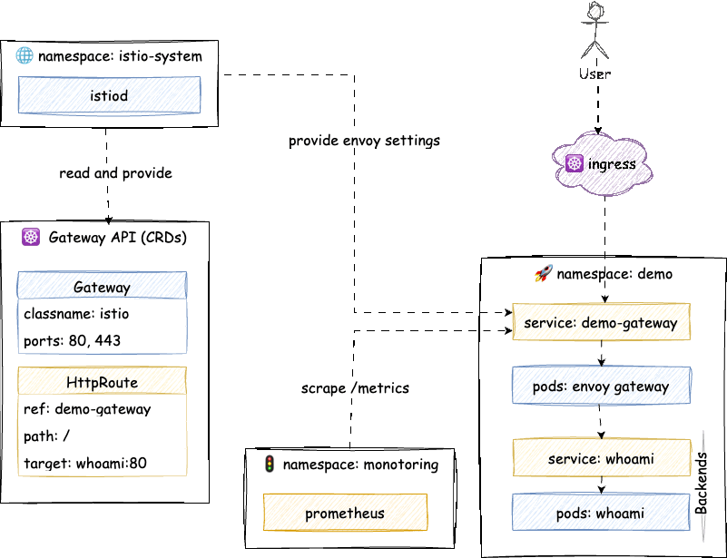

# Gateway API Demo

A Kubernetes Gateway API demonstration project using Istio, KinD (Kubernetes in Docker), and a sample "whoami" application.



## What's Inside

- **KinD Cluster**: Local lightweight Kubernetes cluster for testing
- **Istio Service Mesh**: Configured as the Gateway API provider
- **Gateway API**: Kubernetes-native API for managing network routing
- **Prometheus**: Monitoring stack for observability
- **Sample App**: "whoami" deployment to demonstrate routing

## Prerequisites

- [Docker](https://docs.docker.com/get-docker/)
- [kubectl](https://kubernetes.io/docs/tasks/tools/)
- [KinD](https://kind.sigs.k8s.io/docs/user/quick-start/)

## Quick Start

```bash
# Create KinD cluster and install components
make create
make install

# Deploy the demo application
make deploy

# Port-forward to access services
make port-forward

# View pod status
make pods
```

## Available Commands

```bash
make create      # Create KinD cluster
make delete      # Delete KinD cluster
make recreate    # Recreate cluster (delete + create)
make install     # Install all components (CRDs, Istio, Prometheus)
make deploy      # Deploy demo application
make clean       # Clean up resources
make pods        # Show pod status
make logs        # View application logs
make test        # Run tests
```

## Features

- **Gateway API Integration**: Demonstrates modern Kubernetes routing with Gateway API instead of Ingress
- **Istio Service Mesh**: Control traffic, security policies, and observability
- **Local Development**: Run everything locally with KinD for quick iteration
- **Monitoring**: Built-in Prometheus for metrics collection

## File Structure

- `kind-cluster.yaml` - KinD cluster configuration
- `app.yaml` - Sample "whoami" application deployment
- `gateway.yaml` - Gateway API and HTTPRoute definitions
- `prometheus.yaml` - Prometheus monitoring setup
- `istio-1.24.3/` - Istio service mesh installation files
