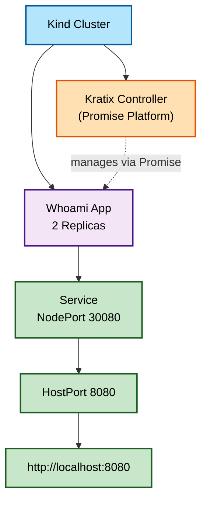

# Kratix + Whoami Setup


## Quick Start

```bash
# Create cluster and deploy everything
make up

# Check status
make status

# Remove cluster
make down
```

## Structure

### Essential Files
- **Makefile** - Simplified build targets
- **kind-config.yaml** - Kind cluster configuration with port mappings
- **iac/whoami-deployment.yaml** - Whoami application (fully consolidated)

### Kept Files
- **iac/whoami-deployment.yaml** - The ONLY YAML needed, fully production-ready with:
  - Namespace
  - Deployment (2 replicas with health checks)
  - Service (NodePort + HostPort)
  - Resource limits
  - Rolling update strategy

## Commands

```bash
make up                 # Create cluster and install everything
make down               # Delete cluster
make whoami            # Deploy whoami app
make whoami-status     # Check whoami status
make whoami-logs       # Follow whoami logs
make whoami-delete     # Remove whoami deployment
make status            # Show full cluster status
make logs              # Show Kratix controller logs
make help              # Show all available commands
```

## Access Points

Once deployed:

- **HostPort (Direct)**: `http://localhost:8080`
- **NodePort (Service)**: `http://localhost:30080`
- **Internal (cluster DNS)**: `http://whoami.whoami-demo.svc.cluster.local`

Both work without kubectl port-forward due to Kind port mappings in `kind-config.yaml`.

## Notes

- Kratix Promise support is documented as non-functional due to upstream bug
- Manual Kubernetes deployment is stable and reliable
- All targets are documented with `make help`
- Internal targets (starting with `_`) are helpers not meant for direct use
