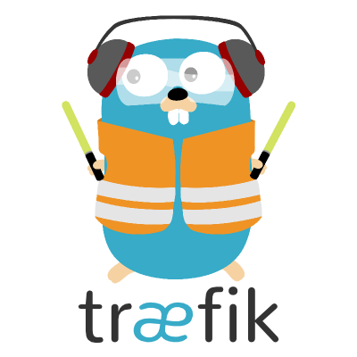
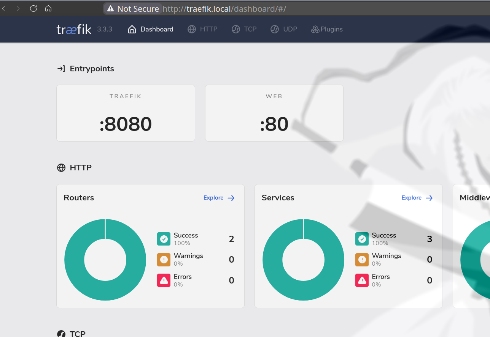
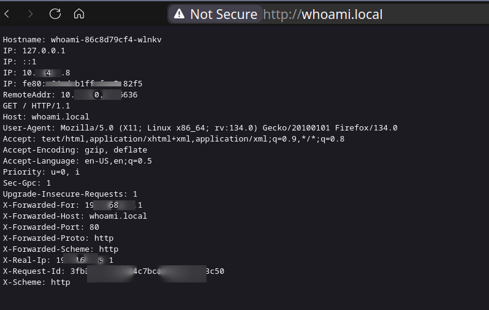
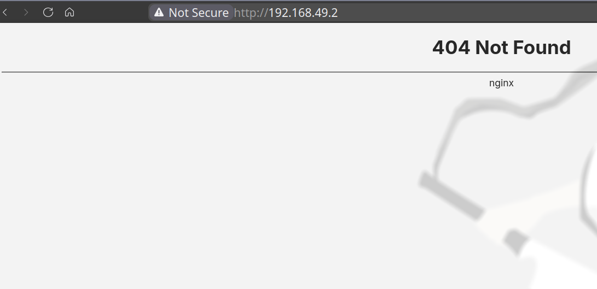

# Intro

This sections contains practical examples using Traefik.



# Minikube
## Ingress

```shell
minikube start
minikube addons enable ingress
minikube addons enable ingress-dns
```

# Deploy
## Traefik deployment

```shell
kubectl apply -f traefik-deployment.yml \
              -f  traefik-dashboard-ingress.yml

kubectl apply -f whoami-deployment.yml \
              -f whoami-ingress.yml
```

# Configure local domain

```shell
minikube ip
```

Adds to /etc/hosts

```shell
echo "$(minikube ip) whoami.local traefik.local" | sudo tee -a /etc/hosts
```

# Inspecting

```shell
kubectl get pods -n kube-system
kubectl get ingress -n kube-system
kubectl get services -n kube-system
kubectl logs -n kube-system -l app=traefik -f
```

# Testing

```shell
curl http://whoami.local/
#Hostname: whoami

curl http://traefik.local/
# Moved Permanently

curl "http://$(minikube ip)"
# 404 Not found
```

## Traefik dashboard routing by host

> The Traefik dashboard is not protected by HTTP basic authentication or any other security measures. It is recommended to restrict access to the dashboard through a VPN or apply a proxy to prevent unauthorized access.




# Whoami pod routing by host



# Minikube IP




# Remove

```shell
kubectl delete -f traefik-deployment.yml \
              -f  traefik-dashboard-ingress.yml

kubectl delete -f whoami-deployment.yml \
              -f whoami-ingress.yml
```


# Troubleshooting

## Storage issues

```shell
minikube delete
docker network prune
minikube start --driver=docker
```